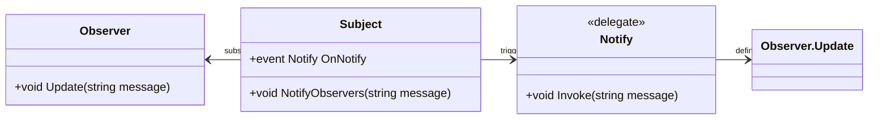

```mermaid
classDiagram
    direction LR

    class Subject {
        +event Notify OnNotify
        +void NotifyObservers(string message)
    }

    class Observer {
        +void Update(string message)
    }

    class Notify {
        <<delegate>>
        +void Invoke(string message)
    }

    Subject --> "triggers" Notify
    Observer <-- "subscribes to" Subject
    Notify --> "defines signature for" Observer.Update
```